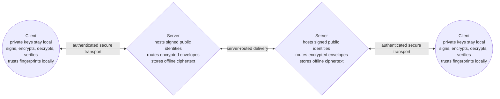
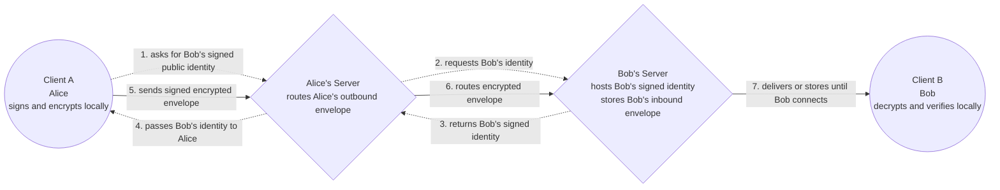
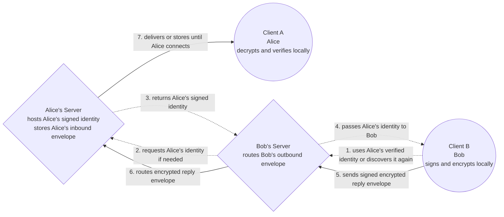

<p align="center">
    
</p>
<hr />

The Endpoint Protocol is an OpenPGP-based encrypted messaging protocol for secure server-routed communication. This repository contains a reference implementation, demo server, demo CLI, and test suite.

> [!WARNING]  
> The code in this repository serves as a Proof-of-Concept and should not be considered stable or production ready.

## Table of Contents

- [Repository Overview](#repository-overview)
  - [Contents](#contents)
  - [Project State](#project-state)
  - [Repository Layout](#repository-layout)
  - [Prerequisites](#prerequisites)
  - [Install From Release](#install-from-release)
  - [How to Run the Demo](#how-to-run-the-demo)
  - [How to Run the Tests](#how-to-run-the-tests)
  - [Development Notes](#development-notes)
- [The Endpoint Protocol](#the-endpoint-protocol)
  - [Protocol Architecture](#protocol-architecture)
  - [Message Structure](#message-structure)
  - [Limitations and Non-Goals](#limitations-and-non-goals)
  - [History (Summarized)](#history-summarized)

## Repository Overview

This repository provides a reference implementation and demo environment. It includes client-side cryptographic behavior, server-side routing behavior, demo setup tooling, and tests that exercise the expected message flow.

### Contents

- A Python package named endpoint,
- A FastAPI-based demo server,
- A command-line demo tool exposed as endpoint,
- A Rust/PyO3 OpenPGP backend built on Sequoia OpenPGP,
- Local setup commands for creating demo clients and server configuration,
- Unit and end-to-end tests for the implementation, and
- A Nix Flake for easy repository use.

### Project State

The current implementation is functional enough to demonstrate the protocol's main behavior: signed identities, authenticated client access, server-routed delivery, offline queueing, WSS mailbox delivery, ack/reject handling, replay protection, and route key-change detection. The current protocol version is endpoint-poc-1. That version should be treated as unstable. Message formats, validation rules, setup workflows, and storage behavior may change as the protocol is refined.

The code has not been independently audited and should not be used for production communication.

### Repository Layout

```
/endpoint/               - Python client, server, protocol, storage, 
                           transport, and CLI code.
/openpgp-sequoia/        - Rust/PyO3 Sequoia OpenPGP backend.
/tests/                  - Unit and end-to-end tests.
/.github/workflows/      - CI workflow for wheel builds and E2E tests.
/.github/assets/         - README and repository presentation assets.
/flake.nix               - Nix development environment and package 
                           definitions.
/pyproject.toml          - Python package metadata.
```

### Prerequisites

The demo requires:

- Python 3.12,
- The endpoint-openpgp-sequoia backend,
- The Python dependencies listed in pyproject.toml, and
- A shell environment where the endpoint CLI is available.

For local development, the repository also includes a Nix flake. The Nix environment is intended to provide the Python, Rust OpenPGP backend, and test dependencies needed to work on the project.

### Install From Release

Current releases provide prebuilt wheels for Windows x86_64. Other platforms must build the endpoint-openpgp-sequoia backend from source until additional prebuilt wheels are published.

Download the Windows x86_64 release assets from the GitHub Release. Releases include the Endpoint protocol wheel, the Windows x86_64 endpoint-openpgp-sequoia wheel, and SHA-256 hashes for the assets.

Verify the downloaded files before installing them. On Windows in PowerShell:
```
Get-FileHash .\endpoint_protocol-0.1.0-py3-none-any.whl -Algorithm SHA256
Get-FileHash .\endpoint_openpgp_sequoia-0.1.0-cp311-abi3-win_amd64.whl -Algorithm SHA256
```

After the hashes match the release notes, install both wheels together:
```
python -m pip install .\endpoint_openpgp_sequoia-0.1.0-cp311-abi3-win_amd64.whl .\endpoint_protocol-0.1.0-py3-none-any.whl
```

For non-Windows platforms, build the OpenPGP backend locally and install the generated backend wheel with the Endpoint protocol wheel:
```
cd openpgp-sequoia
python -m pip install maturin
maturin build --release --out ../dist
python -m pip install ../dist/endpoint_openpgp_sequoia-*.whl ../dist/endpoint_protocol-0.1.0-py3-none-any.whl
```

To build the Windows x86_64 release wheels locally from the repository root:
```
python -m pip install --upgrade pip wheel setuptools maturin
python -m pip wheel . --no-deps --no-build-isolation -w dist
python -m maturin build --manifest-path openpgp-sequoia/Cargo.toml --release --out dist
$wheels = @(
  (Get-ChildItem dist\endpoint_protocol-*.whl).FullName
  (Get-ChildItem dist\endpoint_openpgp_sequoia-*.whl).FullName
)
Compress-Archive -Path $wheels -DestinationPath dist\endpoint-demo-wheels-0.1.0.zip -Force
```

To create a SHA-256 manifest for the release assets:
```
$assets = @(
  (Get-ChildItem dist\endpoint_protocol-*.whl).FullName
  (Get-ChildItem dist\endpoint_openpgp_sequoia-*.whl).FullName
  (Get-ChildItem dist\endpoint-demo-wheels-*.zip).FullName
)
Get-FileHash $assets -Algorithm SHA256 |
  ForEach-Object { "$($_.Hash.ToLower())  $(Split-Path $_.Path -Leaf)" } |
  Set-Content dist\SHA256SUMS.txt
```

### How to Run the Demo

Create a local demo host with Alice as the first client:

```
endpoint setup host-init workspace=demo-host server_url=https://127.0.0.1:8443 bind_host=127.0.0.1 port=8443 owner_ref=alice owner_name=Alice
```

Create an invite for Bob, let Bob join, then enroll Bob on the host:

```
endpoint setup invite workspace=demo-host client_ref=bob out=bob.endpoint-invite.zip
endpoint setup join invite=bob.endpoint-invite.zip workspace=demo-bob name=Bob out=bob.endpoint-enrollment.zip
endpoint setup enroll workspace=demo-host enrollment=bob.endpoint-enrollment.zip
```

Run the demo server:

```
endpoint setup run workspace=demo-host
```

In another shell, send a message from Alice to Bob and receive it as Bob:

```
endpoint send profile=demo-host/clients/alice/profile.json to=bob body="hello bob"
endpoint receive profile=demo-bob/profile.json limit=1 timeout=5
```

Bob can reply using the same demo server:

```
endpoint send profile=demo-bob/profile.json to=alice body="hello alice"
endpoint receive profile=demo-host/clients/alice/profile.json limit=1 timeout=5
```

### How to Run the Tests

Run the test suite with:

```
python -m pytest -q
```

For verbose output:

```
python -m pytest -vv --endpoint-trace
```

The tests cover the core protocol behavior, including OpenPGP operations, signed identity validation, metadata tamper rejection, encrypted delivery, offline queueing, WSS delivery, replay handling malformed input rejection, queue persistence, and CLI demo flows.

### Development Notes

The server stores mailbox state in SQLite. Demo client state, key material, profiles, contacts, invites, enrollments, and generated TLS material are written under the workspaces created by the setup commands.

The OpenPGP backend is a separate package under /openpgp-sequoia/. It is built as a Python extension module and used by the Python implementation through the endpoint_openpgp_sequoia module.

## The Endpoint Protocol

The Endpoint Protocol is an encrypted messaging protocol built around the idea that cryptographic keys are the durable identity layer. Usernames, display names, routes, and profile fields can help people and software find or describe an identity but they are not the identity itself.

The protocol is designed for client-owned cryptography and server-routed delivery. Clients generate and hold private keys, sign public identity material, encrypt outbound messages, decrypt inbound messages, and verify signatures locally. Servers provide discovery, routing, mailbox queueing, and delivery, but they should only handle public identity material and encrypted message envelopes.

### Protocol Architecture



In a typical cross-server conversation, each client uses its own server as a routing and mailbox provider. The sender's client discovers the recipient's signed public identity through the recipient's server, verifies that identity locally, then creates a signed inner message containing the plaintext body and routing context. That signed payload is encrypted to the recipient's public key before it leaves the sender's device.

The sender's server receives only the encrypted envelope and the routing metadata needed to forward it to the recipient's server. The recipient's server can store the encrypted envelope until the recipient comes online, but it cannot read or alter the message body without detection. When the recipient's client receives the envelope, it decrypts it locally, verifies the sender's signature and fingerprint, and compares the inner signed routing fields against the outer envelope before showing the message.



When Bob replies, the same structure is used in reverse. Bob's client treats Alice as the recipient, uses Alice's public key and route information from the verified message or from a fresh identity discovery, signs the reply locally, encrypts it to Alice's public key, and hands only the encrypted envelope to Bob's server. Bob's server then routes that envelope toward Alice's server, where it can wait until Alice's client connects.

Some routing data intentionally appears twice: once in the outer envelope where servers can read it, and again inside the signed encrypted payload where only the recipient can read and verify it. The outer copy lets servers route and queue the message without plaintext access. The inner copy lets the recipient detect tampering, misrouting, replay attempts, or a mismatch between what the server handled and what the sender actually signed.



Servers can act as mailboxes when a recipient is offline. If Bob sends a message while Alice is not connected, Alice's server can queue the encrypted envelope for later delivery according to its retention policy.

When Alice reconnects, her client asks her server for waiting envelopes. Alice's client downloads an envelope, decrypts it locally, verifies the signed payload, checks that the outer routing fields match the signed inner fields, and only then acknowledges successful receipt. After that acknowledgement, the server can remove the envelope from Alice's mailbox.

If Alice's client cannot decrypt or verify the envelope, it can reject it instead of acknowledging it. This keeps unreadable, tampered, or misrouted messages from being silently accepted, while still allowing servers to provide useful offline delivery without becoming trusted with plaintext.

It treats the key as the identity, not the name or route. A username, display name, or server address can help locate or describe someone, but those fields are metadata attached to a signed public identity.

If a route that used to resolve to one fingerprint later resolves to another, the client should not overwrite the old identity. It should treat the new fingerprint as a separate, untrusted identity and let the user decide whether to trust it.

### Message Structure

Endpoint messages are JSON objects. Implementations should treat duplicate JSON keys, unsupported value types, malformed routes, oversized metadata, invalid fingerprints, and unsupported protocol versions as invalid input. Values that are signed must be serialized as canonical JSON before signing or verification.

A route identifies where a client can be reached, but it is not the client's identity:

```json
{
  "server_url": "https://example.com",
  "client_ref": "alice"
}
```

A public identity is the signed public object that a server can host for discovery:

```json
{
  "protocol_version": "endpoint-poc-1",
  "client_ref": "alice",
  "public_key_armored": "<OpenPGP public key>",
  "endpoint_fingerprint": "<fingerprint derived from public_key_armored>",
  "metadata": {
    "username": "alice",
    "display_name": "Alice"
  },
  "identity_signature": "<OpenPGP detached signature>"
}
```

The identity_signature signs the canonical JSON form of protocol_version, client_ref, public_key_armored, endpoint_fingerprint, and metadata. A server may store and return this identity object, but changing any signed field should cause client verification to fail.

The outer message envelope is the server-readable object used for routing and mailbox storage:

```json
{
  "protocol_version": "endpoint-poc-1",
  "message_id": "<unique message id>",
  "sender_route": {
    "server_url": "https://alice.example.com",
    "client_ref": "alice"
  },
  "recipient_route": {
    "server_url": "https://bob.example.com",
    "client_ref": "bob"
  },
  "recipient_fingerprint": "<Bob's endpoint fingerprint>",
  "created_at": "<UTC>",
  "ciphertext_armored": "<OpenPGP encrypted signed inner message>",
  "ciphertext_sha256": "<SHA-256 of ciphertext_armored>"
}
```

The ciphertext decrypts to a signed inner message:

```json
{
  "protocol_version": "endpoint-poc-1",
  "sender_fingerprint": "<Alice's endpoint fingerprint>",
  "signature_algorithm": "openpgp-detached",
  "payload": {
    "protocol_version": "endpoint-poc-1",
    "message_id": "<same message id as outer envelope>",
    "body": "<plaintext message body>",
    "created_at": "<same timestamp as outer envelope>",
    "sender_public_key_armored": "<Alice's OpenPGP public key>",
    "sender_metadata": {
      "username": "alice",
      "display_name": "Alice"
    },
    "sender_fingerprint": "<Alice's endpoint fingerprint>",
    "recipient_fingerprint": "<Bob's endpoint fingerprint>",
    "sender_route": {
      "server_url": "https://alice.example.com",
      "client_ref": "alice"
    },
    "recipient_route": {
      "server_url": "https://bob.example.com",
      "client_ref": "bob"
    }
  },
  "signature": "<OpenPGP detached signature over payload>"
}
```

The signature signs the canonical JSON form of payload. The recipient must derive the sender fingerprint from sender_public_key_armored, verify that it matches both sender fingerprint fields, verify the detached signature, and confirm that recipient_fingerprint matches the recipient's own key.

The recipient must also compare the outer envelope against the signed inner payload. At minimum, message_id, protocol_version, sender_route, recipient_route, recipient_fingerprint, and created_at must match. A mismatch means the server-visible routing envelope and the sender-signed payload disagree, so the message should be rejected.

### Limitations and Non-Goals

The protocol is designed to protect message contents and identity authenticity while messages are routed through servers. It does not hide that communication happened, which servers were involved, when envelopes were routed, or which client routes were used. Servers need enough metadata to discover identities, route envelopes, queue offline messages, and deliver them to the right client.

It does not provide forward secrecy. If a client's private key is compromised, messages encrypted to that key may be recoverable by whoever has access to the compromised key and stored ciphertext. The protocol depends on clients protecting their private keys and on users treating unexpected fingerprint changes as meaningful security events.

It also does not guarantee deletion. A server can remove acknowledged envelopes from its mailbox, but the protocol cannot prove that every copy was erased from server storage, logs, backups, clients, or other systems. Deletion is an operational and implementation concern, not a cryptographic guarantee.

Lastly, it cannot protect against a compromised endpoint. If malware, a hostile operating system, or a malicious client has access to plaintext before encryption or after decryption, the protocol cannot keep that plaintext secret. The protocol's security boundary is the honest client holding its own keys and verifying what it receives.

### History (Summarized)

Elias Murphy, Chief Executive Officer of Raven Technologies Group, came up with the concept of a simple and secure messaging protocol after spending a little over a half hour cursing email in a call with Pharoah, Co-Founder and former member of Raven, in early 2025. The two would spend the following days discussing the possibility and feasibility of an "improved email" with security and simplicity as fundamental principles. This hypothetical protocol would later be named Dragonet.

As 2025 progressed, the concept developed throughout discussions and hypotheticals, and some brief mentions of the concept were discussed in community channels, but Dragonet was ultimately shelved as a concept while they focused on higher-priority initiatives.

By early June 2026, Murphy had returned to the idea once again to build a working proof-of-concept code implementation and truly test the feasibility of the concept. After several days of planning and designing, and three days of programming with input and assistance from Pharoah, the PoC was completed. An additional two days were spent testing and refining with assistance from some of Murphy's close friends and members of the Raven community.

At some point during development, Murphy decided to change the name from the Dragonet protocol to the Endpoint protocol, and designed the logo for it in about an hour using PaintDotNet.
