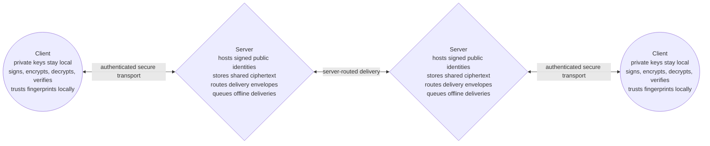
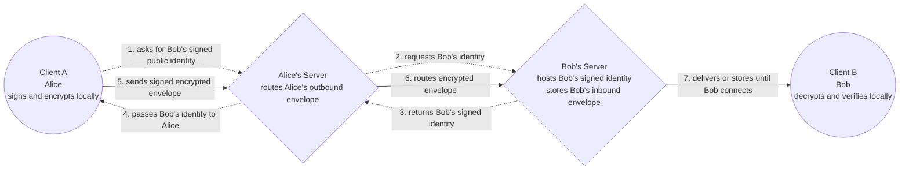
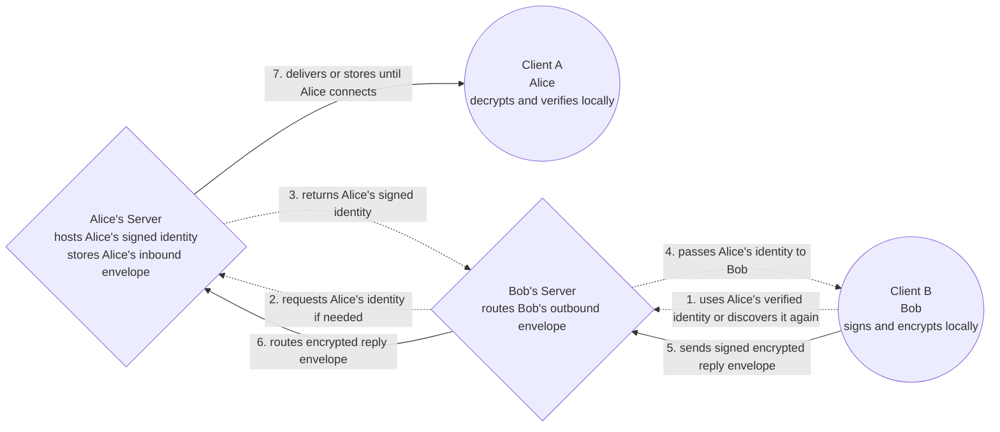

<p align="center">
    
</p>
<hr />

<div align="justify">
The Endpoint Protocol is an OpenPGP-based encrypted messaging protocol for secure server-routed communication. This repository contains a reference implementation, demo server, demo CLI, and test suite.
</div>

<br />

> [!WARNING]  
> The code in this repository serves as a Proof-of-Concept and should not be considered stable or production ready.

## Table of Contents

- [Repository Overview](#repository-overview)
  - [Contents](#contents)
  - [Project State](#project-state)
  - [Repository Layout](#repository-layout)
  - [Prerequisites](#prerequisites)
  - [Install From Release](#install-from-release)
  - [How to Run the Demo](#how-to-run-the-demo)
  - [How to Run the Tests](#how-to-run-the-tests)
  - [Development Notes](#development-notes)
- [The Endpoint Protocol](#the-endpoint-protocol)
  - [Protocol Architecture](#protocol-architecture)
  - [Contact Artifacts](#contact-artifacts)
  - [Message Structure](#message-structure)
  - [Limitations and Non-Goals](#limitations-and-non-goals)
  - [History (Summarized)](#history-summarized)

<div align="justify">

## Repository Overview

This repository provides a reference implementation and demo environment. It includes client-side cryptographic behavior, server-side routing behavior, demo setup tooling, and tests that exercise the expected message flow.

### Contents

- A Python package named endpoint,
- A FastAPI-based demo server,
- A command-line demo tool exposed as endpoint,
- A Rust/PyO3 OpenPGP backend built on Sequoia OpenPGP,
- Local setup commands for creating demo clients and server configuration,
- Unit and end-to-end tests for the implementation, and
- A Nix Flake for easy repository use.

### Project State

The current implementation demonstrates signed identities, authenticated client access, server-routed delivery, offline queueing, WSS mailbox delivery, ack/reject handling, replay protection, route key-change detection, reusable signed content, multi-recipient delivery, private Bcc claims, content references, federation content transfer, and retryable fan-out. The current protocol version is endpoint-poc-2. That version should be treated as unstable as everything is subject to change as the protocol is refined.

The code has not been independently audited and should not be used for production communication.

### Repository Layout

```
/endpoint/               - Python client, server, protocol, storage, 
                           transport, and CLI code.
/openpgp-sequoia/        - Rust/PyO3 Sequoia OpenPGP backend.
/tests/                  - Unit and end-to-end tests.
/.github/workflows/      - CI workflow for wheel builds and E2E tests.
/.github/assets/         - README and repository presentation assets.
/flake.nix               - Nix development environment and package 
                           definitions.
/pyproject.toml          - Python package metadata.
```

### Prerequisites

The demo requires:

- Python 3.12.4,
- The endpoint-openpgp-sequoia backend,
- The Python dependencies listed in pyproject.toml, and
- A shell environment where the endpoint CLI is available.

For local development, the repository also includes a Nix flake. The Nix environment is intended to provide the Python, Rust OpenPGP backend, and test dependencies needed to work on the project.

### Install From Release

Download two wheel files from the GitHub Release and place them in the same directory:

- `endpoint_protocol-0.1.0-py3-none-any.whl` is the platform-independent Endpoint protocol package.
- `endpoint_openpgp_sequoia-0.1.0-...whl` is the native OpenPGP backend for your operating system and CPU architecture.

The backend wheel has a long, platform-specific filename. For example, endpoint_openpgp_sequoia-0.1.0-cp311-abi3-manylinux_2_17_x86_64.manylinux2014_x86_64.whl is a valid Linux x86_64 wheel; do not rename it. In the commands below, * is a shell wildcard that matches the rest of that filename. If the directory contains multiple backend wheels, use the exact filename for your platform instead of the wildcard.

Run the commands below from the directory containing both wheels. The protocol wheel and the matching backend wheel must be installed together.

#### Linux (Debian or Ubuntu)

Debian-based distributions may reject direct installation into the system Python with an externally-managed-environment error because of PEP 668. Create and activate a virtual environment instead:

```bash
sudo apt-get update
sudo apt-get install -y python3-venv
python3 --version
python3 -m venv .venv
source .venv/bin/activate
python -m pip install --upgrade pip
sha256sum endpoint_protocol-*.whl
sha256sum endpoint_openpgp_sequoia-*.whl
```

Compare the SHA-256 values with the release notes before installing, then run:

```bash
python -m pip install ./endpoint_protocol-*.whl ./endpoint_openpgp_sequoia-*.whl
```

If `python3 --version` is older than 3.12, install a newer Python and use its executable (for example, python3.12) when creating the virtual environment. Once the environment is activated, use `python -m pip`; it points to the virtual environment and avoids modifying the system Python. Do not use `--break-system-packages` for this project.

#### Windows (PowerShell)

On Windows in PowerShell:
```
Get-FileHash .\endpoint_protocol-0.1.0-py3-none-any.whl -Algorithm SHA256
Get-FileHash .\endpoint_openpgp_sequoia-0.1.0-*.whl -Algorithm SHA256
```

After verifying the hashes:
```
$backend = Get-ChildItem .\endpoint_openpgp_sequoia-0.1.0-*.whl | Select-Object -First 1
python -m pip install $backend.FullName .\endpoint_protocol-0.1.0-py3-none-any.whl
```

#### macOS

Create a virtual environment so the installation is isolated from the system Python:

```bash
python3 --version
python3 -m venv .venv
source .venv/bin/activate
python -m pip install --upgrade pip
shasum -a 256 endpoint_protocol-*.whl
shasum -a 256 endpoint_openpgp_sequoia-*.whl
```

After comparing the SHA-256 values with the release notes, install both wheels:

```bash
python -m pip install ./endpoint_protocol-*.whl ./endpoint_openpgp_sequoia-*.whl
```

#### Verify the installation

With the virtual environment active on Linux or macOS (or with the normal Python environment on Windows), run:

```
python -c "import endpoint, endpoint_openpgp_sequoia as backend; print(endpoint.PROTOCOL_VERSION); print(backend.__file__)"
endpoint --help
```

If the command prints endpoint-poc-2 and a backend path, both packages are installed. The endpoint command is available while the virtual environment is active; run `source .venv/bin/activate` again in a new shell before using it.

### Build and install from source

If a release does not provide the protocol wheel, or if your platform does not have a compatible prebuilt backend wheel, build both wheels from the repository. This requires Python 3.12 or newer, Rust/Cargo, and a native build toolchain.

On Linux or macOS, create a virtual environment first:

```bash
python3 -m venv .venv
source .venv/bin/activate
python -m pip install --upgrade pip wheel setuptools maturin
python -m pip wheel . --no-deps --no-build-isolation -w dist
python -m maturin build --manifest-path openpgp-sequoia/Cargo.toml --release --out dist
python -m pip install ./dist/endpoint_protocol-*.whl ./dist/endpoint_openpgp_sequoia-*.whl
```

On Windows in PowerShell:

```
py -3.12 -m venv .venv
.\.venv\Scripts\Activate.ps1
python -m pip install --upgrade pip wheel setuptools maturin
python -m pip wheel . --no-deps --no-build-isolation -w dist
python -m maturin build --manifest-path openpgp-sequoia/Cargo.toml --release --out dist
$backend = Get-ChildItem .\dist\endpoint_openpgp_sequoia-*.whl | Select-Object -First 1
python -m pip install $backend.FullName .\dist\endpoint_protocol-0.1.0-py3-none-any.whl
```

### How to Run the Demo

Create a local demo host with Alice as the first client:

```
endpoint setup host-init workspace=demo-host server_url=https://127.0.0.1:8443 bind_host=127.0.0.1 port=8443 owner_ref=alice owner_name=Alice
```

Create an invite for Bob, let Bob join, then enroll Bob on the host:

```
endpoint setup invite workspace=demo-host client_ref=bob out=bob.endpoint-invite.zip
endpoint setup join invite=bob.endpoint-invite.zip workspace=demo-bob name=Bob out=bob.endpoint-enrollment.zip
endpoint setup enroll workspace=demo-host enrollment=bob.endpoint-enrollment.zip
```

Run the demo server:

```
endpoint setup run workspace=demo-host
```

In another shell, send a message from Alice to Bob and receive it as Bob:

```
endpoint send profile=demo-host/clients/alice/profile.json to=bob body="hello bob"
endpoint receive profile=demo-bob/profile.json limit=1 timeout=5
```

Bob can reply using the same demo server:

```
endpoint send profile=demo-bob/profile.json to=alice body="hello alice"
endpoint receive profile=demo-host/clients/alice/profile.json limit=1 timeout=5
```

### How to Run the Tests

Run the test suite with:

```
python -m pytest -q
```

For verbose output:

```
python -m pytest -vv --endpoint-trace
```

The tests cover the core protocol behavior, including OpenPGP operations, signed identity validation, metadata tamper rejection, encrypted delivery, offline queueing, WSS delivery, replay handling malformed input rejection, queue persistence, and CLI demo flows.

### Development Notes

The server stores mailbox state in SQLite. Demo client state, key material, profiles, contacts, invites, enrollments, and generated TLS material are written under the workspaces created by the setup commands.

The OpenPGP backend is a separate package under /openpgp-sequoia/. It is built as a Python extension module and used by the Python implementation through the endpoint_openpgp_sequoia module.

## The Endpoint Protocol

The Endpoint Protocol is an encrypted messaging protocol built around the idea that cryptographic keys are the durable identity layer. Usernames, display names, routes, and profile fields can help people and software find or describe an identity but they are not the identity itself.

The protocol is designed for client-owned cryptography and server-routed delivery. Clients generate and hold private keys, sign public identity material, encrypt outbound messages, decrypt inbound messages, and verify signatures locally. Servers provide discovery, routing, mailbox queueing, and delivery, but they should only handle public identity material and encrypted message envelopes.

### Protocol Architecture


```mermaid
flowchart LR
    ClientA(("Client\nprivate keys stay local\nsigns, encrypts, decrypts, verifies\ntrusts fingerprints locally"))
    ServerA{"Server\nhosts signed public identities\nstores shared ciphertext\nroutes delivery envelopes\nqueues offline deliveries"}
    ServerB{"Server\nhosts signed public identities\nstores shared ciphertext\nroutes delivery envelopes\nqueues offline deliveries"}
    ClientB(("Client\nprivate keys stay local\nsigns, encrypts, decrypts, verifies\ntrusts fingerprints locally"))

    ClientA <--> |"authenticated secure transport"| ServerA
    ServerA <--> |"server-routed delivery"| ServerB
    ServerB <--> |"authenticated secure transport"| ClientB
```

In a typical cross-server conversation, each client uses its own server as a routing and mailbox provider. The sender's client discovers the recipient's signed public identity through the recipient's server, verifies that identity locally, then creates one signed content object and one multi-recipient ciphertext. The sender uploads that ciphertext once to its home server. Each recipient receives a separate signed, recipient-encrypted delivery claim and a small reference to the shared content object.

The sender's server receives only encrypted content, encrypted delivery claims, and the routing metadata needed to forward each envelope. For a remote recipient it transfers the encrypted content object to the recipient's server before forwarding the reference envelope. The recipient's server can store the encrypted content and envelope until the recipient comes online, but it cannot read or alter the message body or authorize a different recipient without detection. When the recipient's client receives an envelope, it fetches the referenced ciphertext, decrypts the delivery claim and content locally, verifies both sender signatures, and compares the authenticated claim against the outer routing envelope before showing the content.


```mermaid
flowchart LR
    Alice(("Client A\nAlice\nsigns and encrypts locally"))
    AliceServer{"Alice's Server\nroutes Alice's outbound envelope"}
    BobServer{"Bob's Server\nhosts Bob's signed identity\nstores Bob's inbound envelope"}
    Bob(("Client B\nBob\ndecrypts and verifies locally"))

    Alice -. "1. asks for Bob's signed public identity" .-> AliceServer
    AliceServer -. "2. requests Bob's identity" .-> BobServer
    BobServer -. "3. returns Bob's signed identity" .-> AliceServer
    AliceServer -. "4. passes Bob's identity to Alice" .-> Alice

    Alice --> |"5. sends signed encrypted envelope"| AliceServer
    AliceServer --> |"6. routes encrypted envelope"| BobServer
    BobServer --> |"7. delivers or stores until Bob connects"| Bob
```

When Bob replies, the same structure is used in reverse. Bob's client treats Alice as the recipient, uses Alice's public key and route information from the verified message or from a fresh identity discovery, signs the reply locally, encrypts it to Alice's public key, and hands only the encrypted envelope to Bob's server. Bob's server then routes that envelope toward Alice's server, where it can wait until Alice's client connects.

Some routing data intentionally appears twice: once in the outer envelope where servers can read it, and again inside the signed encrypted payload where only the recipient can read and verify it. The outer copy lets servers route and queue the message without plaintext access. The inner copy lets the recipient detect tampering, misrouting, replay attempts, or a mismatch between what the server handled and what the sender actually signed.


```mermaid
flowchart LR
    Alice(("Client A\nAlice\ndecrypts and verifies locally"))
    AliceServer{"Alice's Server\nhosts Alice's signed identity\nstores Alice's inbound envelope"}
    BobServer{"Bob's Server\nroutes Bob's outbound envelope"}
    Bob(("Client B\nBob\nsigns and encrypts locally"))

    Bob -. "1. uses Alice's verified identity or discovers it again" .-> BobServer
    BobServer -. "2. requests Alice's identity if needed" .-> AliceServer
    AliceServer -. "3. returns Alice's signed identity" .-> BobServer
    BobServer -. "4. passes Alice's identity to Bob" .-> Bob

    Bob --> |"5. sends signed encrypted reply envelope"| BobServer
    BobServer --> |"6. routes encrypted reply envelope"| AliceServer
    AliceServer --> |"7. delivers or stores until Alice connects"| Alice
```

Servers can act as mailboxes when a recipient is offline. If Bob sends a message while Alice is not connected, Alice's server can queue the encrypted envelope for later delivery according to its retention policy.

When Alice reconnects, her client asks her server for waiting envelopes. Alice's client downloads an envelope, decrypts it locally, verifies the signed payload, checks that the outer routing fields match the signed inner fields, and only then acknowledges successful receipt. After that acknowledgement, the server can remove the envelope from Alice's mailbox.

If Alice's client cannot decrypt or verify the envelope, it can reject it instead of acknowledging it. This keeps unreadable, tampered, or misrouted messages from being silently accepted, while still allowing servers to provide useful offline delivery without becoming trusted with plaintext.

It treats the key as the identity, not the name or route. A username, display name, or server address can help locate or describe someone, but those fields are metadata attached to a signed public identity.

If a route that used to resolve to one fingerprint later resolves to another, the client should not overwrite the old identity. It should treat the new fingerprint as a separate, untrusted identity and let the user decide whether to trust it.

### Contact Artifacts

A signed public identity proves the fingerprint matches the public key and the identity signature verifies against that key. It does not prove that the server returned the key the sender expected for a real-world person. On first contact, a malicious or compromised server could return a different valid identity for the same route. Contact artifacts are a measure against this.

An Endpoint contact reference is route-qualified. The client_ref alone is only the local name part; the usable contact reference is the combination of server_url and client_ref, similar to how email requires both a local part and a domain. A contact artifact contains that route-qualified reference and the expected fingerprint, and may optionally carry the signed public identity object for offline import. It can be shared out of band as plaintext, a URI, or a QR code:
```
endpoint:contact?server_url=https%3A%2F%2Fexample.com&client_ref=bob&fingerprint=ep1%3A...
```

The JSON form is:

```json
{
  "kind": "endpoint-contact",
  "protocol_version": "endpoint-poc-2",
  "server_url": "https://example.com",
  "client_ref": "bob",
  "endpoint_fingerprint": "ep1:...",
  "metadata": {
    "display_name": "Bob",
    "username": "bob"
  }
}
```

When a client imports a contact artifact, it stores the expected fingerprint separately from human trust state and keys the contact by server_url plus client_ref. A later discovery for that exact route must return a signed identity with the same endpoint_fingerprint. If the server returns a different valid identity, the client should reject it as a contact fingerprint mismatch before storing or using it. This provides first-contact substitution protection only when the contact artifact was obtained through a channel not controlled by the queried server.

### Message Structure

Endpoint messages are JSON objects. Implementations should treat duplicate JSON keys, unsupported value types, malformed routes, oversized metadata, invalid fingerprints, and unsupported protocol versions as invalid input. Values that are signed must be serialized as canonical JSON before signing or verification.

A route identifies where a client can be reached, but it is not the client's identity:

```json
{
  "server_url": "https://example.com",
  "client_ref": "alice"
}
```

A public identity is the signed public object that a server can host for discovery:

```json
{
  "protocol_version": "endpoint-poc-2",
  "client_ref": "alice",
  "public_key_armored": "<OpenPGP public key>",
  "endpoint_fingerprint": "<fingerprint derived from public_key_armored>",
  "metadata": {
    "username": "alice",
    "display_name": "Alice"
  },
  "identity_signature": "<OpenPGP detached signature>"
}
```

The identity_signature signs the canonical JSON form of protocol_version, client_ref, public_key_armored, endpoint_fingerprint, and metadata. A server may store and return this identity object, but changing any signed field should cause client verification to fail.

The signed content object is reusable across deliveries. Its signature covers the content ID, content type, creation time, sender key, sender route, and generic content value:

```json
{
  "protocol_version": "endpoint-poc-2",
  "content_id": "<shared content id>",
  "sender_fingerprint": "<Alice's endpoint fingerprint>",
  "signature_algorithm": "openpgp-detached",
  "payload": {
    "protocol_version": "endpoint-poc-2",
    "content_id": "<shared content id>",
    "content_type": "message",
    "created_at": "<UTC>",
    "sender_public_key_armored": "<Alice's OpenPGP public key>",
    "sender_fingerprint": "<Alice's endpoint fingerprint>",
    "sender_route": {
      "server_url": "https://alice.example.com",
      "client_ref": "alice"
    },
    "content": {
      "body": "<plaintext message body>",
      "visible_to": [{"server_url": "https://bob.example.com", "client_ref": "bob"}],
      "visible_cc": []
    }
  },
  "signature": "<OpenPGP detached signature over payload>"
}
```

The outer delivery envelope is the server-readable object used for routing and mailbox storage. It references shared encrypted content so the ciphertext is stored once per server, while delivery_ciphertext_armored contains a recipient-specific encrypted delivery claim:

```json
{
  "protocol_version": "endpoint-poc-2",
  "message_id": "<unique recipient delivery id>",
  "content_id": "<shared content id>",
  "content_sha256": "<SHA-256 of signed content>",
  "sender_route": {
    "server_url": "https://alice.example.com",
    "client_ref": "alice"
  },
  "recipient_route": {
    "server_url": "https://bob.example.com",
    "client_ref": "bob"
  },
  "recipient_fingerprint": "<Bob's endpoint fingerprint>",
  "recipient_role": "to",
  "created_at": "<UTC>",
  "content_ref": {
    "content_id": "<shared content id>",
    "content_sha256": "<SHA-256 of signed content>"
  },
  "delivery_ciphertext_armored": "<OpenPGP encrypted delivery claim for Bob>",
  "delivery_ciphertext_sha256": "<SHA-256 of delivery_ciphertext_armored>"
}
```

The referenced content object is stored by the sender's and recipient's servers, never decrypted by either server, and is fetched through an authenticated client endpoint:

```json
{
  "protocol_version": "endpoint-poc-2",
  "content_id": "<shared content id>",
  "content_sha256": "<SHA-256 of signed content>",
  "ciphertext_armored": "<one OpenPGP ciphertext addressed to all recipients>",
  "ciphertext_sha256": "<SHA-256 of ciphertext_armored>",
  "size_bytes": 1234,
  "created_at": "<UTC>",
  "expires_at": "<UTC retention deadline>"
}
```

Content uploads are idempotent for the same content_id and hashes. A reference delivery is accepted only after the local server has the matching content object; repeated identical reference deliveries are safe retries, while a reused message_id with different authenticated data is rejected.

The delivery ciphertext decrypts to a sender-signed claim:

```json
{
  "protocol_version": "endpoint-poc-2",
  "sender_fingerprint": "<Alice's endpoint fingerprint>",
  "signature_algorithm": "openpgp-detached",
  "payload": {
    "protocol_version": "endpoint-poc-2",
    "message_id": "<same message id as outer envelope>",
    "content_id": "<same content id as outer envelope>",
    "content_sha256": "<same signed-content hash as outer envelope>",
    "created_at": "<same timestamp as outer envelope>",
    "sender_route": {
      "server_url": "https://alice.example.com",
      "client_ref": "alice"
    },
    "recipient_route": {
      "server_url": "https://bob.example.com",
      "client_ref": "bob"
    },
    "recipient_fingerprint": "<Bob's endpoint fingerprint>",
    "recipient_role": "to",
    "sender_fingerprint": "<Alice's endpoint fingerprint>"
  },
  "signature": "<OpenPGP detached signature over payload>"
}
```

The content and delivery claim each sign the canonical JSON form of their own payload. The recipient derives Alice's fingerprint from the public key in the signed content, verifies both signatures, confirms the content hash, and confirms that the claim's recipient fingerprint matches the recipient's own key.

The recipient must also compare the outer envelope against the signed delivery claim. At minimum, message_id, protocol_version, content_id, content_sha256, sender_route, recipient_route, recipient_fingerprint, recipient_role, and created_at must match. A mismatch means the server-visible routing envelope and the sender-authorized claim disagree, so the delivery must be rejected. Bcc recipients are never included in the signed visible_to or visible_cc content fields; their authorization exists only in their private claim.

### Limitations and Non-Goals

The protocol is designed to protect message contents and identity authenticity while messages are routed through servers. It does not hide that communication happened, which servers were involved, when envelopes were routed, or which client routes were used. Servers need enough metadata to discover identities, route envelopes, queue offline messages, and deliver them to the right client.

It does not provide forward secrecy. If a client's private key is compromised, messages encrypted to that key may be recoverable by whoever has access to the compromised key and stored ciphertext. The protocol depends on clients protecting their private keys and on users treating unexpected fingerprint changes as meaningful security events.

It does not guarantee deletion. A server can remove acknowledged envelopes from its mailbox, but the protocol cannot prove that every copy was erased from server storage, logs, backups, clients, or other systems. Deletion is an operational and implementation concern, not a cryptographic guarantee.

It also cannot protect against a compromised endpoint. If malware, a hostile operating system, or a malicious client has access to plaintext before encryption or after decryption, the protocol cannot keep that plaintext secret. The protocol's security boundary is the honest client holding its own keys and verifying what it receives.

Reference delivery reduces duplicate encrypted payload storage and upload work, but it does not hide fan-out. Servers can observe recipient routes, delivery timing, and that multiple envelopes refer to the same content_id and content hash. The current content store also uses a bounded retention timestamp and local cleanup; it does not provide cryptographic deletion, resumable range downloads, or external blob storage.

Lastly, the protocol cannot independently prove that a first-seen route belongs to the real-world person a sender expects. A malicious server could substitute a different valid identity on first contact. Contact artifacts are a simple way to add out-of-band assurance for this case.

### History (Summarized)

Elias Murphy, Chief Executive Officer of Raven Technologies Group, came up with the concept of a simple and secure messaging protocol after spending a little over a half hour cursing email in a call with Pharoah, Co-Founder and former member of Raven, in early 2025. The two would spend the following days discussing the possibility and feasibility of an "improved email" with security and simplicity as fundamental principles. This hypothetical protocol would later be named Dragonet.

As 2025 progressed, the concept developed throughout discussions and hypotheticals, and some brief mentions of the concept were discussed in community channels, but Dragonet was ultimately shelved as a concept while they focused on higher-priority initiatives.

By early June 2026, Murphy had returned to the idea once again to build a working proof-of-concept code implementation and truly test the feasibility of the concept. After several days of planning and designing, and three days of programming with input and assistance from Pharoah, the initial PoC was completed. An additional two days were spent testing and refining with assistance from some of Murphy's close friends and members of the Raven community.

At some point during development, Murphy decided to change the name from the Dragonet protocol to the Endpoint protocol, and designed the logo for it in about an hour using PaintDotNet.
</div>
